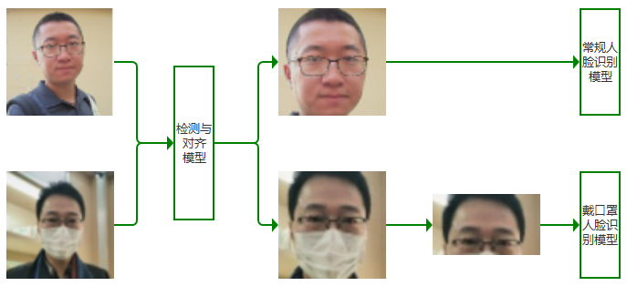
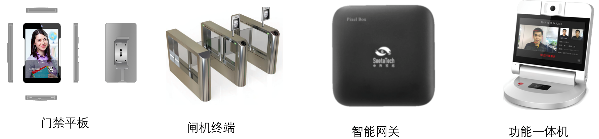

#  **SeetaFace6**

[](LICENSE)

[[中文]()]

## 开源模块

`SeetaFace6`是中科视拓最新开源的商业正式版本。突破了之前社区版和企业版版本不同步发布的情况，这次开源的v6版本正式与商用版本同步。

<div align=center>

</div>

此次开源包含了一直以来人脸识别的基本部分，如人脸检测、关键点定位、人脸识别。同时增加了活体检测、质量评估、年龄性别估计。并且响应时事，开放了口罩检测以及戴口罩的人脸识别模型。

<div align=center>

</div>


同时此次我们开源了商用版最新的推理引擎TenniS，ResNet50的推理速度，从SeetaFace2在I7的8FPS提升到了20FPS。同时人脸识别训练集也大幅度提高，SeetaFace6人脸识别数据量增加到了上亿张图片。

为了应对不同级别的应用需求，SeetaFace6将开放三个版本模型：

模型名称           | 网络结构       | 速度（I7-6700） | 速度（RK3399） | 特征长度
-|-|-|-|-
通用人脸识别       | ResNet-50      | 57ms           | 300ms         | 1024
带口罩人脸识别     | ResNet-50      | 34ms           | 150ms         | 512
通用人脸识别（小） | Mobile FaceNet | 9ms            | 70ms          | 512

作为能力兼容升级，SeetaFace6仍然能够给众多人脸识别应用提供业务能力。

<div align=center>

</div>

同时该套算法适用于高精度的服务器部署外，也可以终端设备上很好的适应运行。
 
<div align=center>

</div>

<div align=center>

</div>

## 编译

### 下载源码

```
git clone --recursive https://github.com/SeetaFace6Open/index.git
```

### 编译依赖
 
1. 编译工具
2. For linux<br>
        GNU Make 工具<br>
        GCC 或者 Clang 编译器
3. For windows<br>
        [MSVC](https://visualstudio.microsoft.com/zh-hans/) 或者 MinGW. <br>
        [jom](https://wiki.qt.io/Jom)
4. [CMake](http://www.cmake.org/)
5. 依赖架构<br>
 CPU 支持 AVX 和 FMA [可选]（x86）或 NENO（ARM）支持

### 编译顺序说明
OpenRoleZoo 为常用操作的集合，SeetaAuthorize  为模型解析工程，TenniS 为前向计算框架。需要重点说明的是，此次 TenniS 同时放出了 **GPU** 计算源码，可以编译出 **GPU** 版本进行使用。上述三个模块为基础模块，各个 SDK 的编译均依赖上述模块，因此需要优先编译出 OpenRoleZoo, SeetaAuthorize 和 TenniS，然后再进行其他 SDK 模块的编译。

### 各平台编译

####  linux 平台编译说明

    cd ./craft
    运行脚本 build.linux.x64.sh(gpu版本为 build.linux.x64_gpu.sh)
    
####  windows 平台编译说明

    cd ./craft
    执行脚本 build.win.vc14.all.cmd 编译各个版本的库(gpu版本为build.win.vc14.all_gpu.cmd)

#### Android 平台编译说明
+ 安装 ndk 编译工具(推荐版本 **ndk-r16b**)
  - 从  https://developer.android.com/ndk/downloads 下载 ndk 并安装
  - 设置环境变量, 导出ndk-build工具

+ 编译
        各个模块均含有 android/jni/Android.mk 和 android/jni/Application.mk 两个编译脚本文件。

        cd 到各模块的 android/jni 目录
        执行 ndk-build -j4 编译

#### 其他 arm 等交叉编译平台
当前版本并未直接对交叉编译平台进行支持， 不过可参考文章 [cmake cross compile](https://zhuanlan.zhihu.com/p/100367053) 的说明进行 CMake 配置和对应平台的编译。 
# 下载地址

### 百度网盘
模型文件：  
Part I: [Download](https://pan.baidu.com/s/1LlXe2-YsUxQMe-MLzhQ2Aw) code: `ngne`, including: `age_predictor.csta`, `face_landmarker_pts5.csta`, `fas_first.csta`, `pose_estimation.csta`, `eye_state.csta`, `face_landmarker_pts68.csta`, `fas_second.csta`, `quality_lbn.csta`, `face_detector.csta`, `face_recognizer.csta`, `gender_predictor.csta`, `face_landmarker_mask_pts5.csta`, `face_recognizer_mask.csta`, `mask_detector.csta`.   
Part II: [Download](https://pan.baidu.com/s/1xjciq-lkzEBOZsTfVYAT9g) code: `t6j0`，including: `face_recognizer_light.csta`.  

### Dropbox
Model files:  
Part I: [Download](https://www.dropbox.com/s/julk1f16riu0dyp/sf6.0_models.zip?dl=0), including: `age_predictor.csta`, `face_landmarker_pts5.csta`, `fas_first.csta`, `pose_estimation.csta`, `eye_state.csta`, `face_landmarker_pts68.csta`, `fas_second.csta`, `quality_lbn.csta`, `face_detector.csta`, `face_recognizer.csta`, `gender_predictor.csta`, `face_landmarker_mask_pts5.csta`, `face_recognizer_mask.csta`, `mask_detector.csta`.   
Part II: [Download](https://www.dropbox.com/s/d296i7efnz5evbx/face_recognizer_light.csta?dl=0) ，including: `face_recognizer_light.csta`.  

# 使用入门

关于基本的接口使用，请参见教程：
[《SeetaFace 入门教程》](http://leanote.com/blog/post/5e7d6cecab64412ae60016ef)，github上有同步[文档源码](https://github.com/seetafaceengine/SeetaFaceTutorial)。

人脸识别的完整示例Demo见 [example/qt](./example/qt)。

在每个压缩包的文档中都包含了对应平台上的调用示例，请解压对应平台压缩包后分别获取。

# 接口文档

各模块接口参见 [docs](./docs)

# 开发者社区

欢迎开发者加入 SeetaFace 开发者社区，请先加 SeetaFace 小助手微信，经过审核后邀请入群。


# 联系我们

`SeetaFace` 开源版可以免费用于商业和个人用途。如果需要更多的商业支持，请联系商务邮件 bd@seetatech.com。

